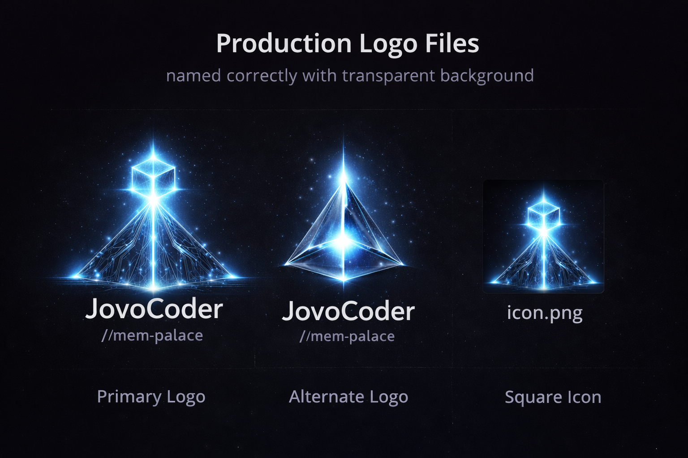

  

# JovoCoder

A local-first AI runtime that **doesn’t just remember — it works.**

Built on top of MemPalace by Milla Jovovich & Ben Sigman. Their release of this gave me the breakthrough moment layer that I needed to create an open source completely free non-API required orchestra with full features and it's free. Thank you for the inspiration and breakthrough Ben and Milla.

---

## The Breakthrough

I didn’t set out to build another AI tool. In fact, had been fooling around with trying to build something like this for few weeks. I was stuck at the memory layer part of it, which is frankly one of the most important. Having to explain myself over and over again every time I went to work on this massive stack that I've developed for my publishing companies was very frustrating trying to control the drift. Explaining my project to the agent every time I started was absolutely maddening. And then I see MemPalace. It was a Eureka moment where I was able to go, "That's the missing part that I have not built."

I installed MemPalace. Yeah that's pretty much. What did it.

MemPalace gave me perfect recall.

What it didn’t give me was:
- a way to act on that memory
- a way to enforce rules
- a way to keep work moving forward without resetting

So I built the missing layer on top of what they built and I've connected it to my completely open source Ollama stack.

---

## The Problem

You finally get an AI to understand your system. As anyone knows it's frustrating because it has no recall to speak of very little, and you burned through a lot of tokens and time telling the same thing over and over again when it goes off the guard rails when it ignores your direct to some prompts and just break stuff.

You explain:
- your architecture
- your constraints
- your failures
- your rules

And then…

It forgets everything.

You start over.

Every session.

---

Even worse:

- You repeat the same instructions constantly
- You fight hallucinated “success”
- You lose debugging context
- You pay for tokens just to re-explain your own system

---

## MemPalace Solves Memory

MemPalace is the first system that actually fixed memory issues immediatelu so I could make this:

- stores everything
- retrieves intelligently
- runs locally
- no API required

It is the foundation.

---

## The Missing Layer

Memory alone is not enough.

You still need:
- execution
- workflow
- control

That’s what JovoCoder adds.

---

## JovoCoder

JovoCoder turns memory into action.

It adds:

- agent roles (planner / coder / validator)
- persistent task tracking
- memory write-back
- safe refinement loops
- a real working CLI

---

## What This Changes

Instead of:

prompt → guess → forget

You now have:

memory → retrieval → reasoning → validation → continuity

---

## How It Works

MemPalace → memory + retrieval  
JovoCoder → orchestration + workflow  
Ollama → local model execution  

---

## Features

- Local-first (no cloud required)
- Zero API by default
- Persistent memory and tasks
- Verifiable workflows
- No hallucinated success
- Multi-role reasoning (planner / coder / validator)
- CLI-based agent runtime

---

## Install

bash scripts/install.sh  
bash scripts/verify.sh  

---

## Run

/home/critic/bin/jovocoder  

---

## Commands

/help  
/add TASK  
/tasks  
/done ID  
/remember NOTE  
/memory  
/resume  
/handoff  
/next  
/autoloop TASK  

---

## Models

Default role mapping:

Planner → llama3.1:8b  
Coder → codellama:13b-instruct  
Validator → gemma4:26b  

---

## Philosophy

- Local-first  
- Deterministic behavior  
- Explicit memory  
- Controlled execution  
- No hallucinated success  

---

## Attribution

JovoCoder is built on top of MemPalace.

MemPalace was created by Milla Jovovich & Ben Sigman and is used here as the memory and retrieval layer.

This project does not modify MemPalace itself — it adds an orchestration and execution layer on top of it.

MemPalace is used in accordance with its open source license.

---

## Status

v0.1.0 — Initial public release
