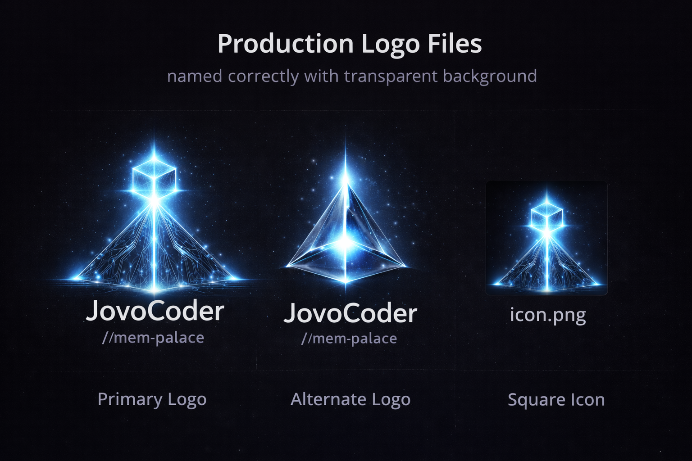

<p align="center">
  
</p>

# JovoCoder

JovoCoder is a shell-based command runner for local checks and SSH audits. It validates commands against a small safety policy before running them and prints the resulting command output.

This repository contains JovoCoder. It is not the Nomad project.

## Current Scope

JovoCoder provides four command paths:

```text
/exec <command>
/audit
/ssh-audit <target>
/exec-task <task>
```

- `/exec` runs a command only when it passes the built-in validator.
- `/audit` runs a fixed local system audit.
- `/ssh-audit` runs a fixed read-only audit against a configured safe target.
- `/exec-task` handles the task patterns implemented in the script.

Some plain-language input is mapped to those commands. Input that does not match a deterministic route is sent to the configured Ollama model for a text response.

## Requirements

- Bash
- Python 3
- Ollama
- An Ollama service available to run `gemma3:4b` for unmatched plain-language input
- SSH for remote audits

Ollama is currently required at startup. MemPalace is not required.

## MemPalace

JovoCoder does not import the MemPalace API or automatically search a palace. Its current script retains legacy history and state files under `~/.mempalace`, but that directory use is not a native MemPalace integration.

MemPalace commands can be run through JovoCoder's validated `/exec` path when MemPalace is installed, just like other allowed shell commands. For example:

```text
/exec mempalace --version
/exec mempalace search "release process" --wing example
```

### Tested Compatibility

| JovoCoder | MemPalace | Tested | Result |
| --- | --- | --- | --- |
| 0.2.0 (`8c92821`) | [3.9.0](https://github.com/MemPalace/mempalace/releases/tag/v3.9.0) | September 6, 2026 | Passed through `/exec` |

The test ran `mempalace --version` and a live wing-filtered search through JovoCoder's validator. MemPalace reported version 3.9.0 and returned hybrid cosine-similarity and BM25 search results.

This confirms command-level compatibility. It does not imply a native JovoCoder-to-MemPalace API integration.

When upgrading an older palace, run:

```bash
mempalace repair-status
```

The tested MemPalace 3.0.0 to 3.9.0 upgrade required the archive-first repair recommended by MemPalace:

```bash
mempalace repair --mode from-sqlite --archive-existing --yes
```

Preserve the archived palace until post-upgrade searches are verified.

## SSH Targets

The current executable reads SSH targets from `~/jovocoder/config/ssh_targets.json`. The repository file contains non-routable examples; replace those placeholders in your local checkout before using remote audits, and do not commit real host details.

Only targets marked `"safe": true` are accepted by the SSH command paths.

## Install

```bash
bash scripts/install.sh
bash scripts/verify.sh
```

The installer places `jovocoder` in `~/bin` and creates its legacy state files under `~/.mempalace`.

Run it with:

```bash
jovocoder
```

If `~/bin` is not in your `PATH`, run `~/bin/jovocoder` or add that directory to your shell configuration.

## Safety Boundaries

JovoCoder uses pattern-based validation. It blocks several destructive or write-capable command forms and restricts SSH commands to configured safe targets.

This is a guardrail, not a security sandbox. Review the script and target configuration before using it on systems that matter.

## Version

Current version: `0.2.0`
